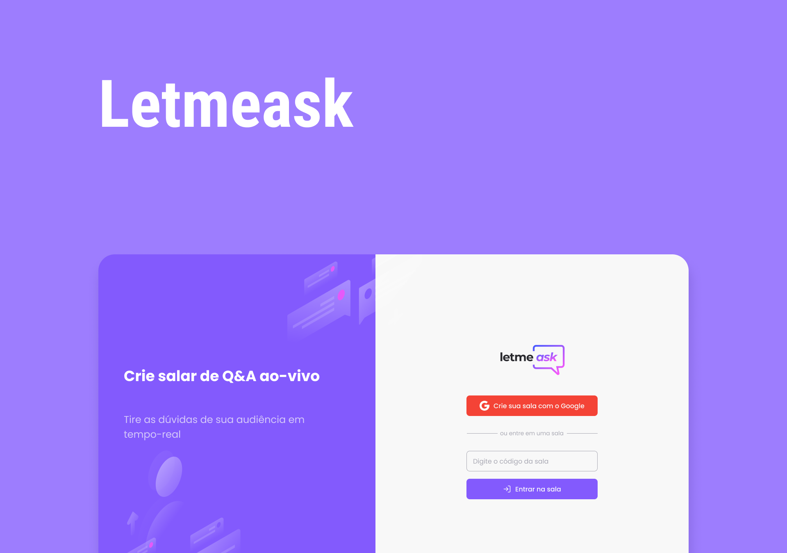

<h1 align="center">
  
</h1>

<h1 align="center">
  
</h1>
<h3 align="center">Você pode acessar o projeto <a href="https://letmeask-project-react.web.app/" target="_blank">clicando aqui</a></h3>
<br/>
<hr/>
<h2>
  Sobre o projeto
</h2>
<p>O <strong>Letmeask</strong> é uma plataforma de perguntas e respostas divididas em salas, desenvolvido para sanar a dificuldade de quem faz aulas ao-vivo em responder perguntas feitas no chat da onde a aula está acontecendo. O público pode enviar perguntas para serem respondidas em tempo-real. Para acessar a plataforma é necessário ter uma conta no <a href="https://www.google.com/" target="_blank">Google</a> para fazer o login e assim poder enviar uma pergunta em uma sala existente ou criar sua própria sala, também é possível curtir perguntas de outros usuários. Na área do Admin, ele consegue marcar a pergunta como respondida, curti-lá, exclui-lá e encerrar a sala.</p>
<br/>
<hr />

<h2>Tecnologias</h2>
<ul>
  <li><a href="" target="_blank">React</a></li>
  <li><a href="" target="_blank">TypeScript</a></li>
  <li><a href="" target="_blank">Sass</a></li>
  <li><a href="" target="_blank">Firebase</a></li>
</ul>
<br/>
<hr />
<h2>Como baixar o projeto</h2>

```bash
# Clonar o repositório
$ git clone https://github.com/wellingtonrodriguesbr/letmeask

# Entrar no diretório
$ cd letmeask

# Instalar as dependências
$ yarn install

# Rodar o projeto
$ yarn start
```
<br/>
<hr/>

<p align="center">Desenvolvido por <a href="https://www.linkedin.com/in/tonrodrigues/" target="_blank">Wellington Rodrigues</a> ✌🏽</p>
